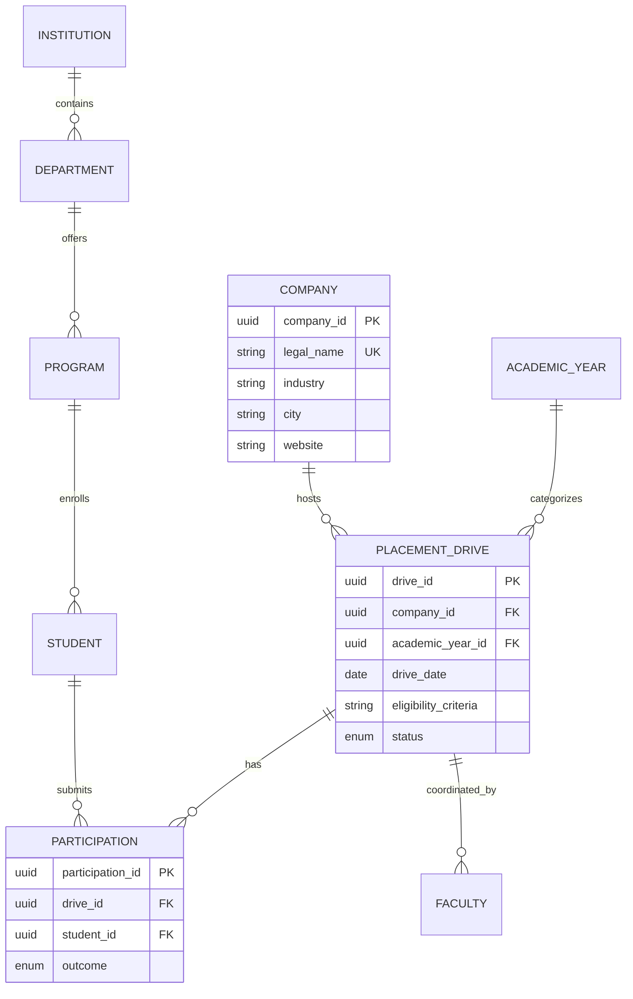

# PlaceTrack ER Design

## Key integrity decisions

- `company.legal_name` is unique after canonicalisation (trimmed, case-insensitive), preventing duplicate employer masters.
- `placement_drive.company_id` is a foreign key. A drive stores no company name, sector, or location; those values are inherited through the relationship.
- The add-drive screen searches/selects an existing company rather than asking the reviewer to type company details again.
- A unique index on `(company_id, academic_year_id, drive_date)` prevents accidental duplicate drive entries.

## Report queries

- Companies by year: join `placement_drive` to `company`, group by academic year.
- Industry participation: join drives to companies, group by `company.industry`.
- Repeat recruiters: group `placement_drive` by `company_id`, keep counts greater than one.
